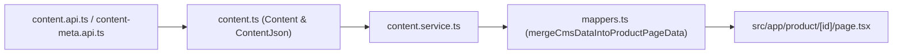

# Agent Notes: Wattsan Website

This repository implements the public storefront and configurator for **Wattsan CNC** equipment.

---

## 1. Project Structure & Architecture

| Layer | Path | Purpose |
| --- | --- | --- |
| **App Router** | `src/app/` | Next.js dynamic & static routes (e.g. `src/app/product/[id]/page.tsx`, `src/app/product/cnc-router/page.tsx`). |
| **UI Components** | `src/components/` | Modular UI blocks (e.g. `src/components/modules/product-page/`). |
| **API Clients** | `src/api/` | Axios requests to `https://api.wattsancnc.com` using Telerik filter formatting. |
| **Domain Models & Mappers** | `src/classes/` | Domain classes (`Content`, `ContentMeta`, `ContentJson`) that encapsulate mapping and locale resolution. |
| **Services** | `src/services/` | Page-facing orchestration (`content.service.ts`, etc.). |
| **Types** | `src/types/` | TypeScript interfaces for products, specifications, configurator, and page data. |
| **Constants** | `src/constants/` | API URL and dynamic content section schemas (`content-sections.ts`). |

---

## 2. Dynamic Content (`Content` & `ContentMeta`) Architecture

All non-characteristic sections on product pages are powered dynamically by the CMS. The architecture follows a strict **API &rarr; Class &rarr; Service &rarr; Page** flow:

### 2.1 Schema Definition (`src/constants/content-sections.ts`)
Defines the `product_page` reference type and all supported sections (`info_cards`, `facts_cards`, `power_of_machine`, `heart_of_machinery`, `safety_cabin`, `rotary_device`, `separate_rotary_device`, `multi_spindles`, `automatic_tool_switch`, `liquidCooling`, `aspiration_system`, `table_types`, `production_process`, `service_and_support`, `package_list`, `faq`, `reviews`, `product_info_extra`).

### 2.2 Domain Models (`src/classes/content.ts` & `src/classes/content-meta.ts`)
- **`Content`**: Represents the section record (`id`, `referenceType`, `referenceId`, `section`, `title`, `displayOrder`, `isActive`).
- **`ContentMeta`**: Represents individual key-value attributes (`keyName`, `type`, `value`, `value_AR`, `filemanager`).
- **`ContentJson`**: Extends `Content`, reducing all `contentMetas` into a clean dictionary `contentMetasJson[keyName]` with automatic locale and filemanager URL resolution. Provides typed conversion methods:
  - `toProductInfoCards()`
  - `toFactsCard()`
  - `toMachineFeatures()`
  - `toHeartOfTheMachinery()`
  - `toSafetyCabin()`
  - `toRotaryDevice()`
  - `toSeparateRotaryDevice()`
  - `toMultiSpindles()`
  - `toToolSwitch()`
  - `toLiquidCooling()`
  - `toTableTypes()`
  - `toProductionStep()`
  - `toServiceAndSupport()`
  - `toPackageListItem()`
  - `toFAQItem()`
  - `toReviewItem()`

### 2.3 Service Layer (`src/services/content.service.ts`)
- **`readContentAsJsonByFilter(filter, locale)`**: Formats a Telerik query string (e.g. `referenceType~eq~'product_page'~and~referenceId~eq~'3'`), fetches the content items and missing metas, and returns initialized `ContentJson[]`.
- **`loadProductPageDynamicContent(referenceId, locale)`**: Groups dynamic content items by section for a specific product ID or slug.

### 2.4 Data Merging (`src/api/product/mappers.ts`)
`mergeCmsDataIntoProductPageData(baseData, cmsSectionsMap)` takes the base mock layout data for the product type and seamlessly overlays any sections customized in the CMS. If a section is not yet customized in the CMS, it safely falls back to the default design mock data.

---

## 3. Product Page Integration

### 3.1 Dynamic Product Route (`src/app/product/[id]/page.tsx`)
1. Fetches live product parameters and characteristics via `getProductById(params.id)` and `getFullCharacteristics()`.
2. Fetches dynamic CMS layout data via `getProductPageData(params.id)`.
3. Binds each non-characteristic UI component to the resolved `baseMockData` properties:
   - `<ProductInfoCards cards={baseMockData.infoCards} />`
   - `<WattsanFactsSlider cards={baseMockData.factsCards} />`
   - `<ProductDescription features={baseMockData.machineFeatures} />`
   - `<HeartOfTheMachinery data={baseMockData.heartOfTheMachinery} />`
   - `<ProductionProcess steps={baseMockData.productionProcess} />`
   - `<ServiceAndSupport image={baseMockData.serviceAndSupport.image} cards={baseMockData.serviceAndSupport.cards} />`
   - `<PackageList items={baseMockData.packageList} />`
   - `<FAQ items={baseMockData.faqData} />`
   - `<ProductReviews reviews={baseMockData.reviews} />`

### 3.2 Category Slug Routes (`/product/cnc-router`, `/product/laser-co2`, etc.)
Category slug routes pass their category identifier to `getProductPageData('cnc-router')` or `getProductPageData('laser-co2')`, allowing default templates to also be managed through the CMS.

---

## 4. Telerik Query Conventions

The backend `GET /api/Content/Read` and `GET /api/ContentMeta/Read` endpoints use Telerik DataSource filter syntax:
- Single clause: `filter=referenceType~eq~'product_page'`
- Multiple clauses: `filter=referenceType~eq~'product_page'~and~referenceId~eq~'3'`
- OR clauses for IDs: `filter=(contentId~eq~'1'~or~contentId~eq~'2')`
- Paging: `page=1&pageSize=500`
